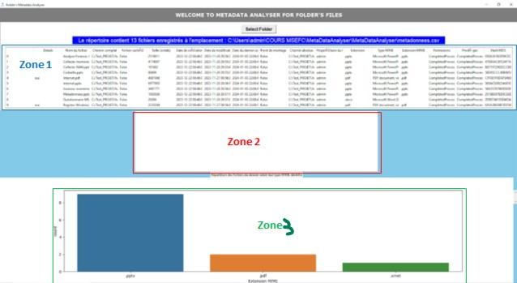

# MetaDataAnalyser

MetaDataAnalyser is a school project of a group of student at the [University of Technology of Troyes](https://www.utt.fr/formations/mastere-specialise/expert-en-cybersecurite) 

This project aims to develop a Python utility to extract metadata from various file types located in a specific directory on the disk. The tool, currently compatible with Windows, provides a user-friendly interface for selecting the directory to analyze. It then scans audio, video, image, PDF, and Office files, extracting corresponding metadata and saving it for future use. The goal is to deliver an intuitive tool, particularly beneficial for forensic analysts, offering a comprehensive analysis of files, including their specific metadata. Currently available for Windows, a Linux version might be developed in the future, but the processing of Apple files is not supported in the current release.


### Disclaimer

This project is a school assignment. It was done for **learning purposes** and is thus **not intended for production**.  
Don't copy. Learn.  

I gathered all the resources that were helpful in the `doc` directory. You can check it out but don't copy and paste code without understanding how it works.

## Requirements

run the follow command to set up your local project

```
    > pip install -r requirements.txt
```


## Installation

1. Clone the repository and its dependencies:
```console
$ git clone --recursive https://github.com/fabdoulaye/MetaDataAnalyser.git
```


## Usage

At launch, this program takes as an argument the location of a directory on the disk.

1. Click on the “Select Folder” button, then select the folder to analyze and wait for the result.
2. The file metadata found in the selected directory is displayed in area 1 (zone 1). See the screenshot below. 

3. Double-click on a line whose Details field is set to yes to display the details of the metadata in zone 2.

4. Position yourself on zone 2 then unfold (click on the + button) the displayed lines to view their values.

5. The zone 3 displays the statistics of the file extensions present in the selected directory.
   

## Acknowledgements

School project done at [University of Technology of Troyes](https://www.utt.fr/study-at-utt).


## License

See `LICENSE` for more information.
